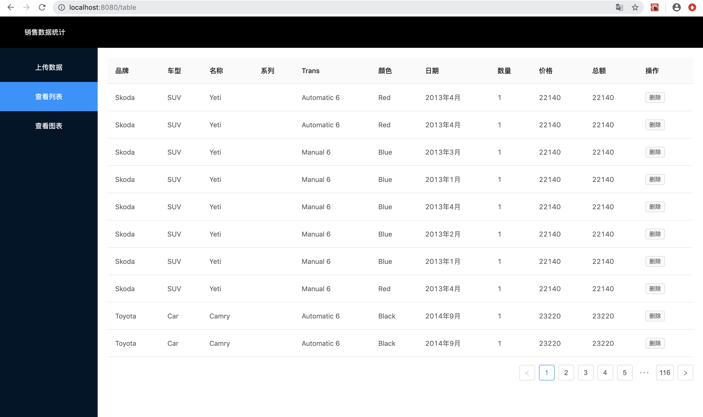
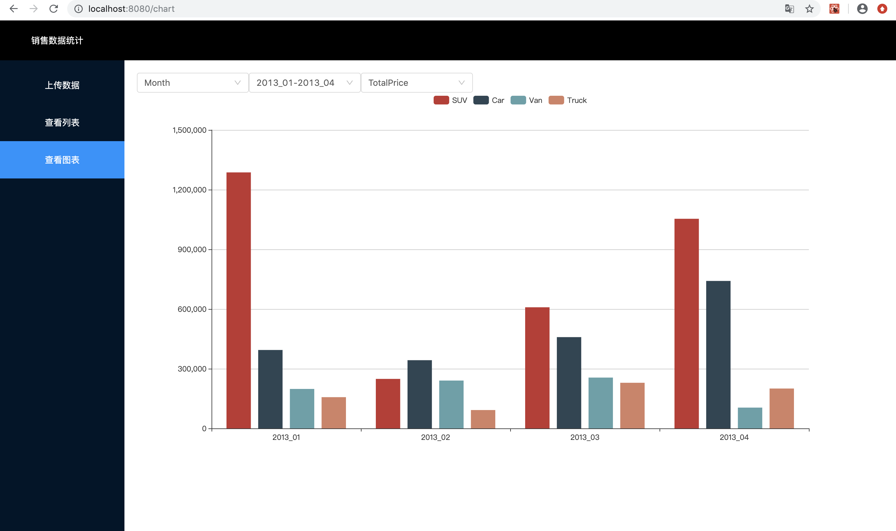

##  技术栈
react / react-router / redux / axios / less / antd / webpack

##### 语法检查：eslint
##### 格式化统一：prettier


##  项目运行
```
npm run dev
```
## 说明
源于一道面试题，做完之后有了自己的新想法，想用react全家桶做一版，于是就有了这个小项目。
**上传数据的数据源文件存储在models文件夹内**

## 预览

